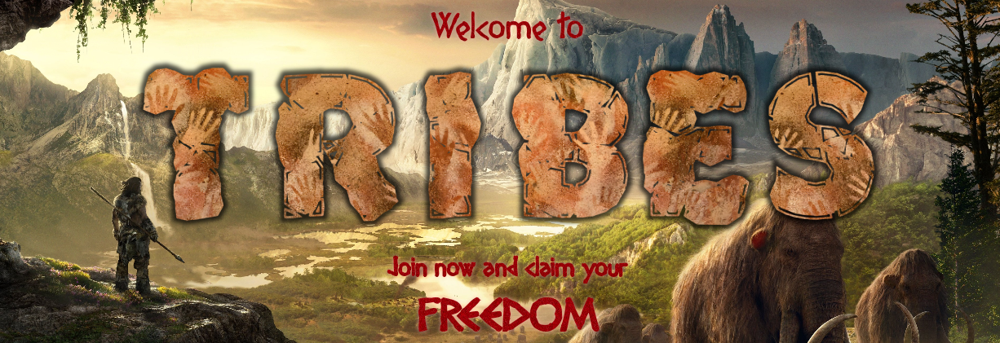
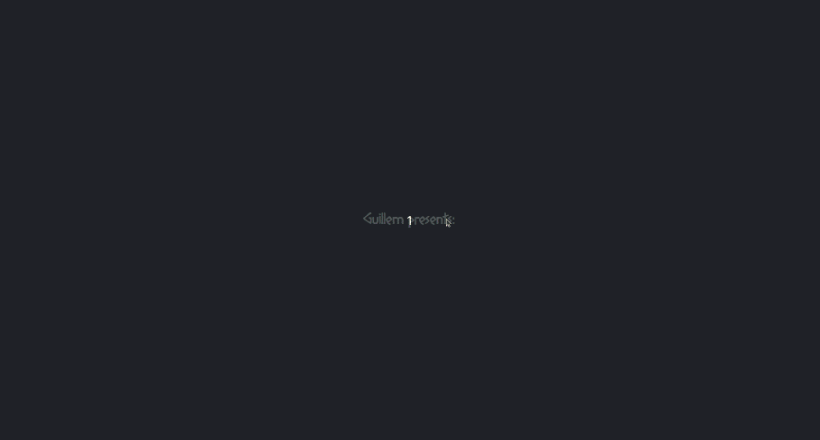
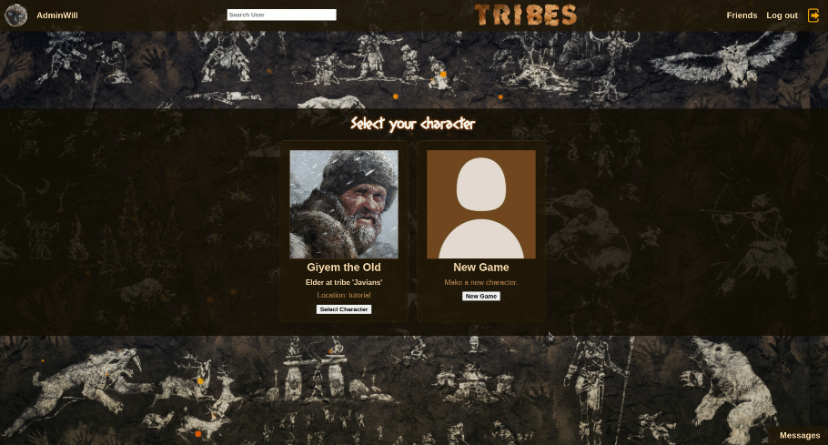

</img>

# Browser Game & Social Network

## Overview

This is a single-page application website made with React that allows users to sign in and play a 'choose-your-path' browser game.
The app also includes a functional lobby where users can find other users, befriend each other, and chat globally or privately.
At the game's prologue the player is asked a few questions, and the answers given determine the stats of the new character.

Note: The app is optimized for desktop full-screen.

## Features

-   Login & Registration forms
-   Forgotten password recovery via email
-   Lobby has a top navigation that allows the user to:
    -   View & edit personal profile
    -   Find other users by name
    -   View list of friends, as well as friendship requests
    -   Notification dot for new friendship requests
    -   Log out button
-   On the lower right corner is the button that toggles the chat, that allows the user to:
    -   Talk to everyone, in a common chat room.
    -   Talk to a specific friend on a channel only available for the two parties.
    -   View the login status of friends in real time, marked with a green dot next to their name
-   In the personal profile, the user can upload a profile picture as well as add a small biography
-   Users can also change their username and the account's linked email
-   The app includes background music (experimental)

## Technology

-   
  &nbsp;  &nbsp;  &nbsp;  &nbsp;  &nbsp;  &nbsp;  &nbsp;  &nbsp; 

-   JavaScript, AWS S3, Node.js, Express.js, PostgreSQL, Socket.IO, React & Redux

## Preview

**_Welcome Page_**

 The 'registration', 'login' and 'password recovery' forms are located in the title screen. Each of them is a React subcomponent.

The background is a <b>Far Cry Primal</b> wallpaper, photoshopped into multiple layers, and given to each one a lateral sway in order to achieve a parallax effect (the man, the mammoths, and the nearby mountains are each a different layer).

Primitive-themed music from the game <b>Dawn of Man</b> is added to enhance immersiveness.

 

**_Lobby_**

The main menu is also the lobby of the game. Here you can either create a new character (new game) or continue with an old one. All your progress is sent to the server and stored in the database.

 

**_New Game_**

The prologue is a succession of story text and questions, and a new character is created based on those questions. The user then is prompted to choose a name and an image file as their character portrait. A confirmation question is made in the end of the prologue.

 
